# 第2周：无人机焊接介绍

# 实践课程大纲

1.1 目标：

1. 理解无人机整体硬件架构及动力系统组成，掌握机架、电池、电子调速器、无刷电机、螺旋桨等主要部件的功能及相互关系。

2. 掌握无人机动力套件的基本选型方法，理解 电机 KV 值、桨叶尺寸、电池电压与容量、电调额定电流等参数对推力、功率、续航和安全裕量的影响。

3. 掌握无人机悬停状态下的 单电机推力、整机功率、放电电流与电池容量 的基本计算方法，能够根据起飞重量和力效表完成动力需求估算。

4. 熟悉常用焊接工具及规范操作方法，掌握合格焊点的判断标准，能够识别 虚焊、锡桥、焊锡过多或过少 等常见问题，并完成基本元器件焊接。

1\.2 硬件准备

|序号|检查项|确认标准|
|---|---|---|
|1|无人机动力套件|机架、飞控/一体飞控电调、无刷电机、螺旋桨、锂电池|
|2|遥控与通信设备|遥控器、接收机|
|3|焊接设备|恒温电烙铁、烙铁架|
|4|焊接耗材|焊锡丝、助焊剂、硅胶线、热缩管、接插件|
|5|辅助工具|剥线钳、剪钳、镊子、吸锡器|
|6|检测设备|数字万用表|
|7|实践器件|电源板、飞控/电调焊盘、SH1\.0 等待焊接线材|

对滤波电容、电源线、电机相线、接收机以及开发板供电等关键连接进行说明。

<strong>⚠️ 操作过程中必须按照规定线路连接，禁止随意改变接线顺序。</strong>

# 实践一：焊接操作

## 1\.1 **滤波电容识别**

### \(1\) 操作目的：

滤波电容用于降低动力系统电压波动，吸收电机高速运行产生的瞬态电流，

提升飞控和电调供电稳定性。

### \(2\) 识别方法：

① 长引脚代表正极；

② 短引脚代表负极；

③ 外壳黄色条纹位置为负极标识。

### \(3\) 焊接要求：

电容正极必须连接电源正极，电容负极必须连接电源负极。

<strong>⚠️ 电容禁止反接。</strong>

## 1\.2 滤波电容与电源线焊接

### \(1\) 电源线定义：

红色线：电源正极（\+）

黑色线：电源负极（\-）

### \(2\) 焊接步骤：

① 清理焊盘；

② 焊盘和线芯预镀锡；

③ 对准焊接位置；

④ 加热融合；

⑤ 检查焊点。

### \(3\) 合格标准：

焊点饱满、表面光亮、无虚焊、无锡桥。

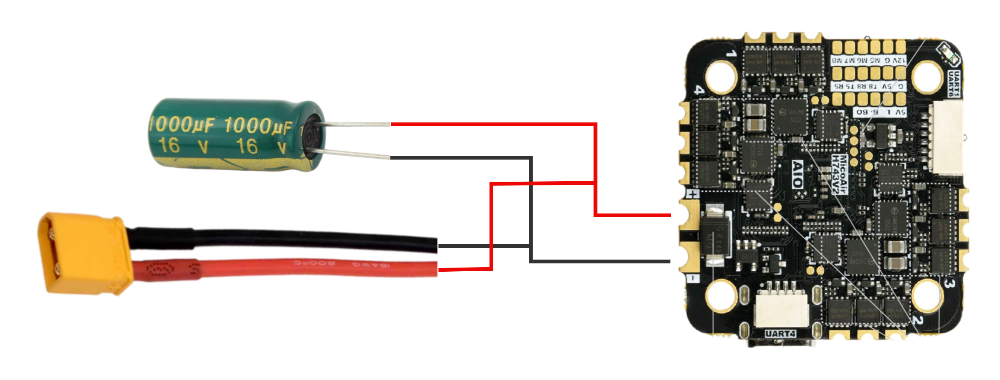

  <video width="950" controls>
    <source src="
    https://diffrobots.oss-cn-hangzhou.aliyuncs.com/j30v2-wiki/video/Radar_positioning_test.mp4" type="video/mp4">
  </video>

## 1\.3 **电机三相线焊接**

电机三根相线连接电调输出端。

三根线均为黑色，必须保证焊接牢固。

### \(1\) 检查要求：

① 三根线分别对应电调输出端；

② 焊点圆润；

③ 不得出现连锡。

④ 顺序焊接，无交叉

  <video width="950" controls>
    <source src="
    https://diffrobots.oss-cn-hangzhou.aliyuncs.com/j30v2-wiki/video/Radar_positioning_test.mp4" type="video/mp4">
  </video>

## 1\.4 **接收机焊接**

### \(1\) 接收机常用三线定义：

红色：VCC供电

黑色：GND地线

蓝色：TX数据输出

### \(2\) 连接规则：

接收机TX连接飞控RX，串口通信采用TX\-RX交叉连接。

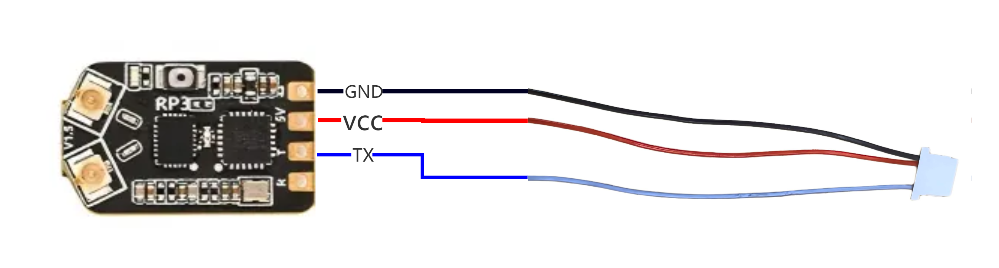

  <video width="950" controls>
    <source src="
    https://diffrobots.oss-cn-hangzhou.aliyuncs.com/j30v2-wiki/video/Radar_positioning_test.mp4" type="video/mp4">
  </video>

## 1.5 开发板通常采用5V供电。

### \(1\) 接线定义：

红色、黑色：5V电源

黄色、绿色：GND

### \(2\) 禁止：

未确认电压情况下直接通电。

  <video width="950" controls>
    <source src="
    https://diffrobots.oss-cn-hangzhou.aliyuncs.com/j30v2-wiki/video/Radar_positioning_test.mp4" type="video/mp4">
  </video>

## 1\.6 **焊接完成检查流程**

- 电源正负极是否正确；

- 滤波电容方向是否正确；

- 电机线是否牢固；

- 接收机TX/RX是否连接正确；

- 开发板供电是否为5V；

- 是否存在短路、锡桥。

## 1\.7 **常见错误**

1. 电容正负极接反 —— 可能导致电容损坏；

2. 电源线短路 —— 可能烧毁电调或飞控；

3. 焊点虚焊 —— 飞行过程中可能断电；

4. TX接TX —— 无法通信；

5. 焊锡过多形成锡桥 —— 导致短路。

# 实践二：**组装教程**

## 1\.1 飞控安装

本步骤将飞控固定到机架中心，并提前安装机载电脑固定柱。飞控是整机姿态控制的核心，安装方向和减震状态会直接影响后续校准与飞行稳定性。完成后，飞控应位于主板中心，箭头朝向机头，并与碳纤板保持可靠绝缘和减震间隙。

### \(1\) 安装过程

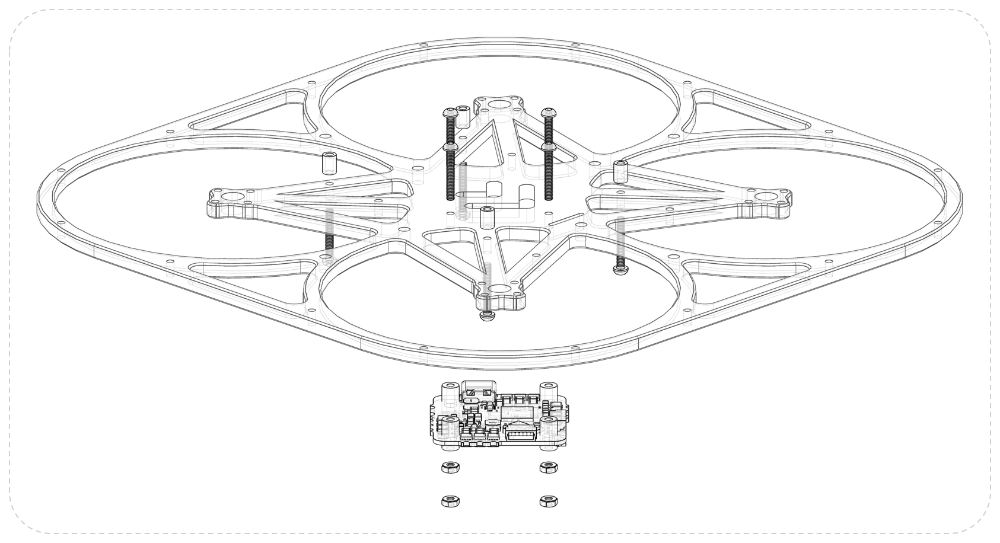

1. 在碳纤主板的机载电脑预留孔位安装 4 颗 M2×14 圆头螺丝。

1. 在 M2×14 螺丝上拧紧 M2×4×5 圆形铝柱，完成机载电脑安装柱的预固定。

2. 将 TF 卡插入飞控板。

3. 将 4 个 M2×7\.5 减震柱安装到飞控板。减震柱较长的一端位于飞控正面。

4. 将飞控放置在碳纤主板中心孔位，确认飞控箭头朝向机头，飞控正面朝上，碳纤主板在飞控上方。

5. 使用 4 颗 M2×14 圆头螺丝和 M2 六角螺母固定飞控。

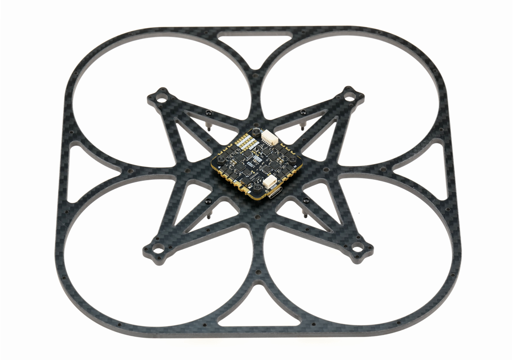

### \(2\) **完成后检查**

> ✅ 飞控箭头朝前，正面向上，碳纤主板在飞控上方。
> 
> ✅ 飞控板上元件与碳纤板之间无接触。
> 
> ✅ 减震柱均匀受压，无明显歪斜或压扁。
> 
> 

### \(3\) **常见错误**

> ⚠️ 未装 TF 卡。后续飞行日志和脚本无法保存。
> 
> ⚠️ 飞控方向装错。后续姿态显示异常。
> 
> 

## 1\.2 动力系统组装

本步骤安装四个无刷电机。动力系统是整机风险最高的部分，会直接影响飞行安全。完成后，四个电机应固定牢靠，电机线束贴合机臂。如有条件，建议给电机固定螺丝加上螺丝胶，防止多次飞行后螺丝松动造成安全隐患。

### (1\) 安装过程

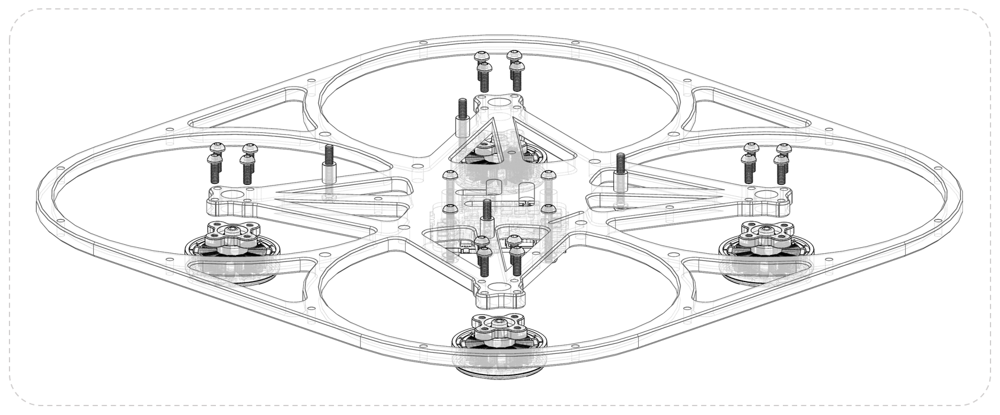

1. 使用 M2×6 螺丝将四个电机固定至碳纤主板电机安装位。

2. 将电机线束沿机臂内侧拉直，使用醋酸胶布将线束紧密缠绕固定于机臂上。

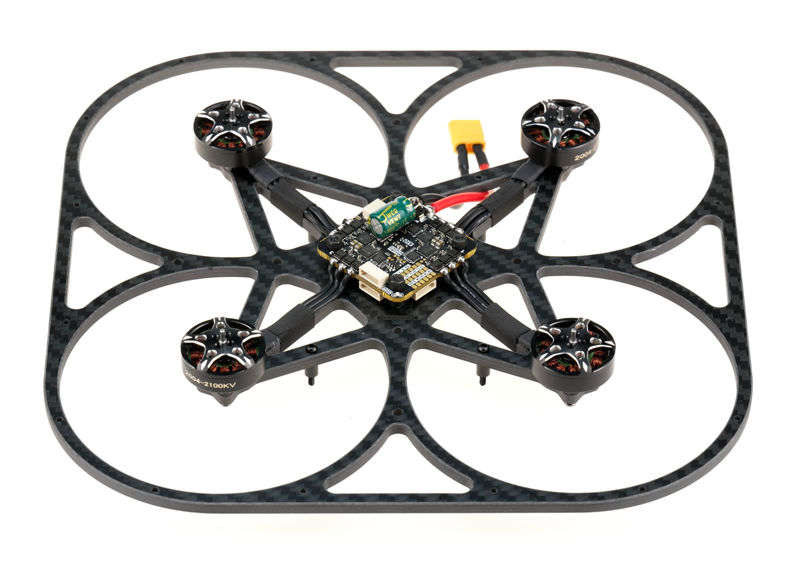

### \(2\) 完成后检查

> ✅ 四个电机固定牢固，无松动。
> 
> ✅ 用手转动电机，电机转动流畅，无异物阻滞感。
> 
> ✅ 线束紧密贴合机臂，无外露线缆可能接触桨叶。
> 
> 

## 1\.3 接收机安装

本步骤在底板上安装Radiomaster RP3接收机。它负责遥控/数传链路，因此接线线序和安装方向都需要确认无误。完成后，接收机和线束应固定在底板指定位置，并为后续主板合装留出走线空间。

### \(1\) 安装过程

将无人机原本的接收机和打印机拆卸下来，使用304\-内六角\-M3\*8\-原色圆头螺丝\*4，再将我们自己的接收机固定打印件固定上去

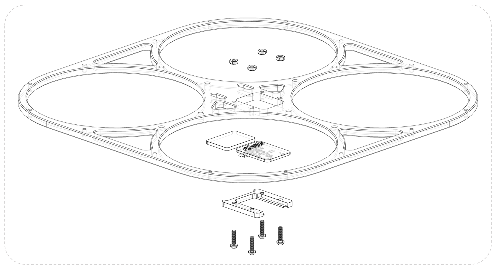

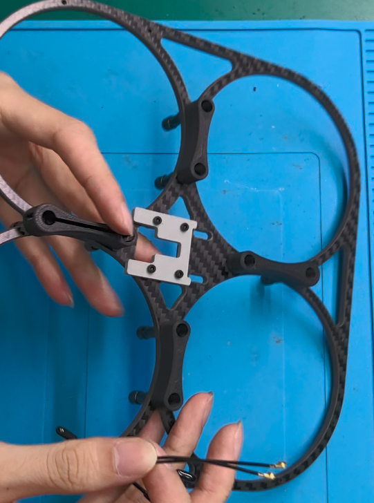

将天线侧着穿过脚架的通孔与凹槽，扣紧天线与 rp3 接收机的 IPEX 接口，然后装上热缩管加热收缩，将硅胶线穿碳板挖槽，最后用扎带固定接收机和天线

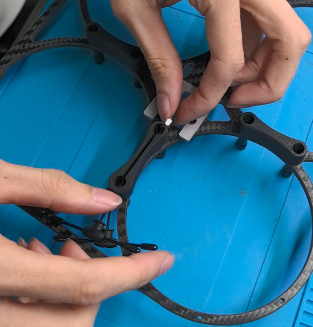

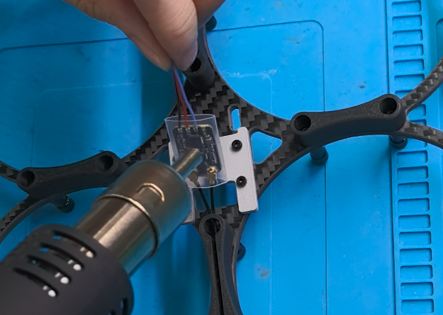

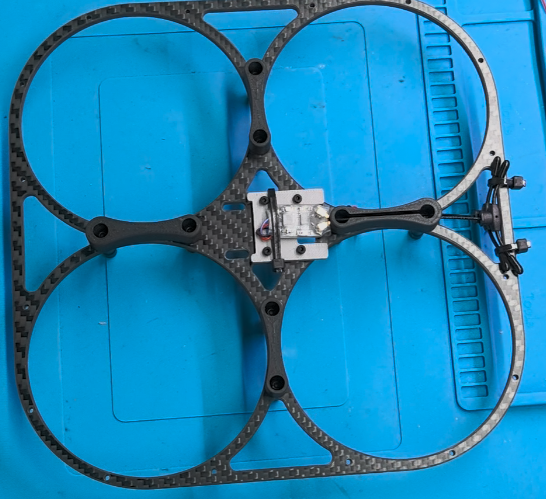

### \(2\) 安装视频：

  <video width="950" controls>
    <source src="
    https://diffrobots.oss-cn-hangzhou.aliyuncs.com/j30v2-wiki/video/Radar_positioning_test.mp4" type="video/mp4">
  </video>

### \(3\) **完成后检查**

> ✅ 接收机和传感器接线插接牢固，无松脱。
> 
> ✅ MTF\-02P 安装方向：测距仪探头靠前，光流镜头靠后。
> 
> 

### \(4\) **常见错误**

> ⚠️ SH1\.0 插头没有垂直插入，导致针脚弯曲，供电异常或数据不通。
> 
> ⚠️ TRS 接收机线序不正确，导致后续数据不通或飞控无法识别。
> 
> 

# 总结

### 1\.课堂总结

1. 认识动力系统组成：无人机动力链主要由电池、电调、无刷电机和螺旋桨构成，各部件参数需要相互匹配，不能独立选型。

2. 掌握动力套件基本选型逻辑：根据起飞重量和目标推重比确定推力需求，再结合桨叶、电机、电池和电调参数进行匹配，其中电调还需预留足够的电流和电压裕量。

3. 理解功率与电池需求计算：可由起飞重量、单桨推力和力效估算悬停功率，再根据电池电压计算工作电流，为电池容量选择提供依据。

4. 掌握基本焊接规范：合理控制烙铁温度和焊接时间，焊后重点检查虚焊、锡桥及电源大电流焊点，并使用万用表进行通断检查。

### 2\.课后作业

1. 根据给定无人机配置，指出电池、电子调速器、电机和螺旋桨 在动力链路中的作用，并画出“电池 → 电调 → 电机 → 桨叶”的动力传递关系。

2. 已知一架四旋翼无人机起飞重量为 2000 g，计算悬停时每个旋翼至少需要提供的推力；再结合课堂力效表，估算对应的悬停功率和悬停电流。

3. 给出一组电机、桨叶和电池参数，根据最大工作电流判断电调额定电流是否满足要求，并说明为什么电调选型必须留有一定的电流裕量。

4. 独立完成指定导线或元器件的焊接操作，焊后使用万用表检查通断与短路情况，并依据“饱满、牢固、无虚焊、无锡桥”的标准判断焊点是否合格。
